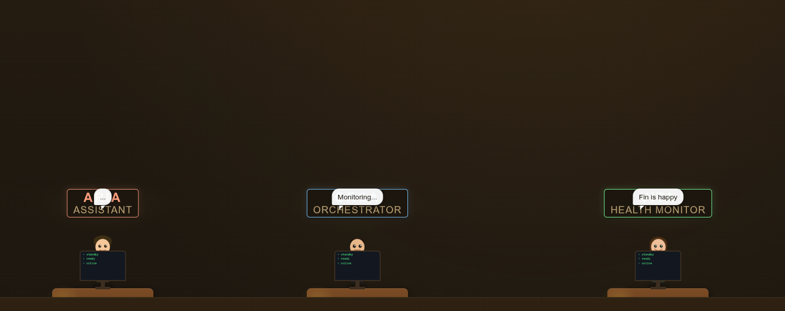

# Agent Office

A cute animated desktop app that puts a tiny office of AI agents on your screen. Each agent watches a log file and reacts in real time — working, chilling with wine, stressing with a cigarette, or celebrating a completed task.



---

## What it does

- Each agent has their own desk, monitor, pet, and personality
- Animations change based on what their log file is doing
  - **Working** — typing animation, screen glows
  - **Idle** — leaning back, sipping 🍷
  - **Alert** — lights up, reaches for a 🚬
  - **Complete** — jumps for joy (click them for a ✋ high five)
- Speech bubbles show their current status, persistently
- Agents send comms lines to each other when routing events
- Name tags float above their heads so you always know who's who

---

## Agents (default)

| Agent | Role | Watches |
|-------|------|---------|
| ARIA  | Assistant | `assistant.log` |
| ORCA  | Orchestrator | `orchestrator.log` |
| VITA  | Health Monitor | `health.log` |
| TIDY  | Disk Cleanup | `disk.log` |
| WADE  | Kodi Guard | `kodi.log` |

---

## Setup

### Requirements
- Node.js
- npm

### Install

```bash
git clone https://github.com/ajax80/SEezIt.git
cd SEezIt
npm install
```

### Run

```bash
npm start
```

By default the app watches `~/agents/logs/`. Point it at your own log directory:

```bash
AGENT_LOG_DIR=/path/to/your/logs npm start
```

---

## Customising agents

Open `main.js` and edit the `AGENTS` object to match your own scripts and log files:

```js
const AGENTS = {
  myagent: {
    name: 'MYAGENT', role: 'My Role',
    logs: ['myagent.log'],
    workPattern: /doing stuff/i,
    errorPattern: /error|fail/i,
    completePattern: /done|success/i,
    commsTarget: null   // or another agent id to draw a comms line to
  }
}
```

Then update the matching entry in `index.html` under the `const AGENTS` block to set the colour, pet, quips etc.

---

## Log format

The app reads any log file — no special format needed. It classifies each new line against your `workPattern`, `errorPattern`, and `completePattern` regexes and updates the agent's state accordingly.

---

## Built with

- [Electron](https://www.electronjs.org/)
- [chokidar](https://github.com/paulmillr/chokidar) — file watching
- Pure CSS animations & SVG characters
